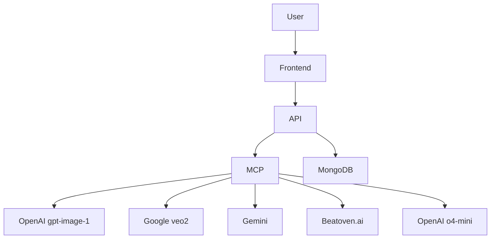

# Genesis

## 🏆 Overview

**Genesis Music Learning App** 

 Our app allows users to generate custom songs about the topic of their choice in various genres to help them learn concepts and make learning more fun and engaging.
 
As a learner, I want to generate custom songs and music videos about the topic I'm studying, in a genre I enjoy, so I can use rhythm, rhyme, and repetition to better remember key concepts and make learning feel fun and memorable.

Instructional Designer: As a Instructional Designers, I want to generate custom songs and music videos about the topic that I know that students typically struggle with in a genre they enjoy, so they can use rhythm, rhyme, and repetition to better remember key concepts and make learning feel fun and memorable.

It integrates **OpenAI's `gpt-image-1`**, **Google's `veo2` video model**, **Gemini**, and **OpenAI's `o4-mini`**, coordinated by the MCP to dynamically route requests to the best model for each input type.

Built with a **Javascript Vue 3 frontend** and **FastAPI backend**, using **MongoDB** for persistence, and **deployed on Render** for fast and reliable hosting. We use the beatoven.ai API for music generation: https://github.com/Beatoven/public-api/blob/main/docs/api-spec.md

This repository is the initial shell prototype for rapid development at **[Hackathon Name]** on **[Date]**.

---

## ⚙️ Tech Stack

- **Language:** Python (backend), JavaScript (frontend)
- **Frameworks:** FastAPI (backend), (frontend — Vue with JS)
- **AI Models:**
  - OpenAI `gpt-image-1` (image generation)
  - Google `veo2` (video generation)
  - Beatoven.ai (music generation)
  - Gemini (LLM)
  - OpenAI `o4-mini` (LLM)
- **MCP:** Model Context Protocol for AI model orchestration
- **Database:** MongoDB
- **Deployment:** Render

---

## 📐 System Architecture



---

## 🧪 API Endpoints

| Endpoint         | Method | Description                                        |
|-----------------|--------|----------------------------------------------------|
| `/api/generate`   | POST   | Accepts input and routes to MCP for model dispatch |
| `/api/health`     | GET    | Returns API health check (used by Render)          |
| `/api/models`     | GET    | Returns list of available models                   |

---

## 🚀 How to Run (Locally)

```bash
# Install backend dependencies
pip install -r requirements.txt

# Run FastAPI backend
uvicorn main:app --reload

# Frontend (if using Node/npm)
cd frontend
npm install
npm run dev
```

### 🌐 Deployment (Render)

1. **Connect GitHub repo** to Render
2. Create a **Web Service** for the FastAPI backend
   - Build Command: `pip install -r requirements.txt`
   - Start Command: `uvicorn main:app --host 0.0.0.0 --port 10000`
   - Health Check Path: `/api/health`
3. Create a **Static Site** for the frontend
   - Build Command: `npm install && npm run build`
   - Publish Directory: `frontend/dist` (or your build dir)

---

## 💡 Planned Features

- [ ] Initial integration with OpenAI `gpt-image-1`
- [ ] MCP routing logic for multi-modal input
- [ ] Video generation workflow using `veo2`
- [ ] Frontend input form for image/video/text
- [ ] MongoDB schema for request tracking
- [ ] Deployment pipeline with Render

---

## 📝 Notes

- MCP routes between LLM, image, and video models
- This is a shell prototype for hackathon delivery
- Future scope: authentication, rate limiting, request queuing

---

## ✨ Contributors

- Shawn Faison
- Steven Lee
- Stephanie Tayo